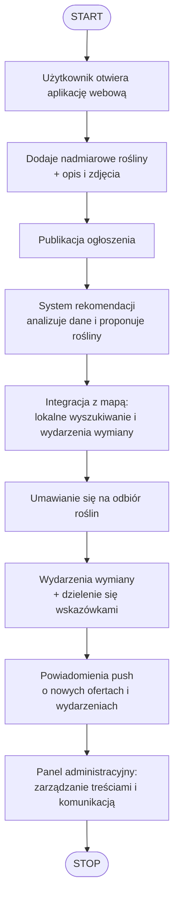

```mermaid

flowchart TD
    START([START]) --> A[Użytkownik otwiera aplikację webową]
    A --> B[Dodaje nadmiarowe rośliny<br/>+ opis i zdjęcia]
    B --> C[Publikacja ogłoszenia]
    C --> D[System rekomendacji<br/>analizuje dane i proponuje rośliny]
    D --> E[Integracja z mapą:<br/>lokalne wyszukiwanie i wydarzenia wymiany]
    E --> F[Umawianie się na odbiór roślin]
    F --> G[Wydarzenia wymiany<br/>+ dzielenie się wskazówkami]
    G --> H[Powiadomienia push<br/>o nowych ofertach i wydarzeniach]
    H --> I[Panel administracyjny:<br/>zarządzanie treściami i komunikacją]
    I --> STOP([STOP])
```
